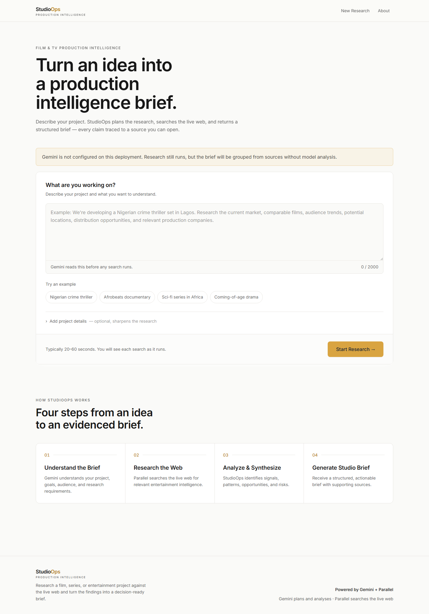
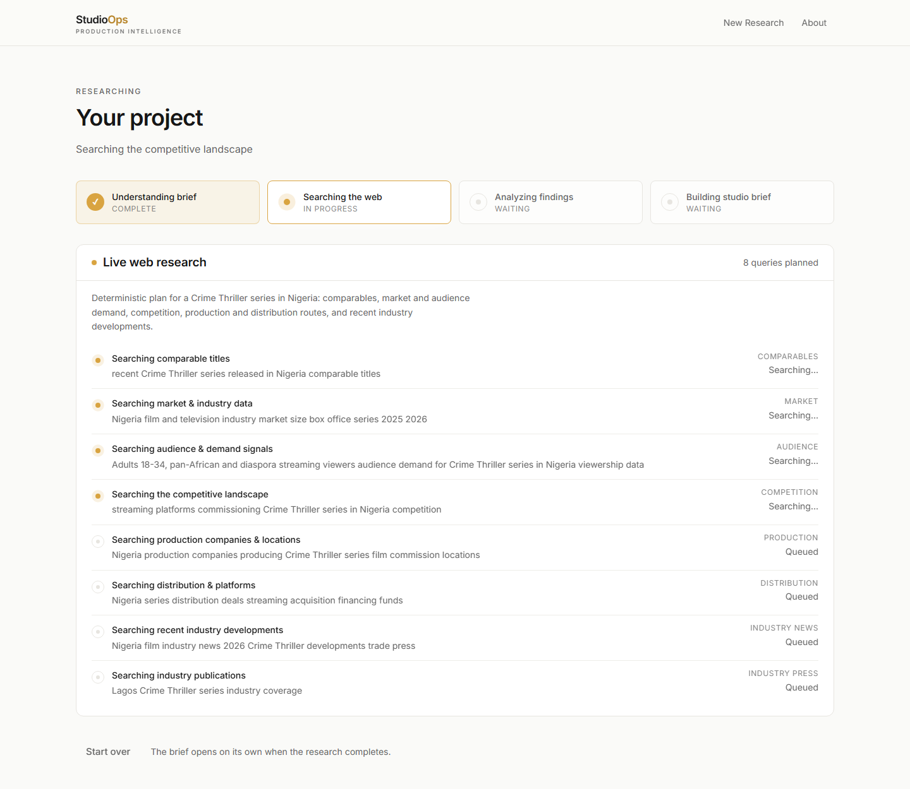
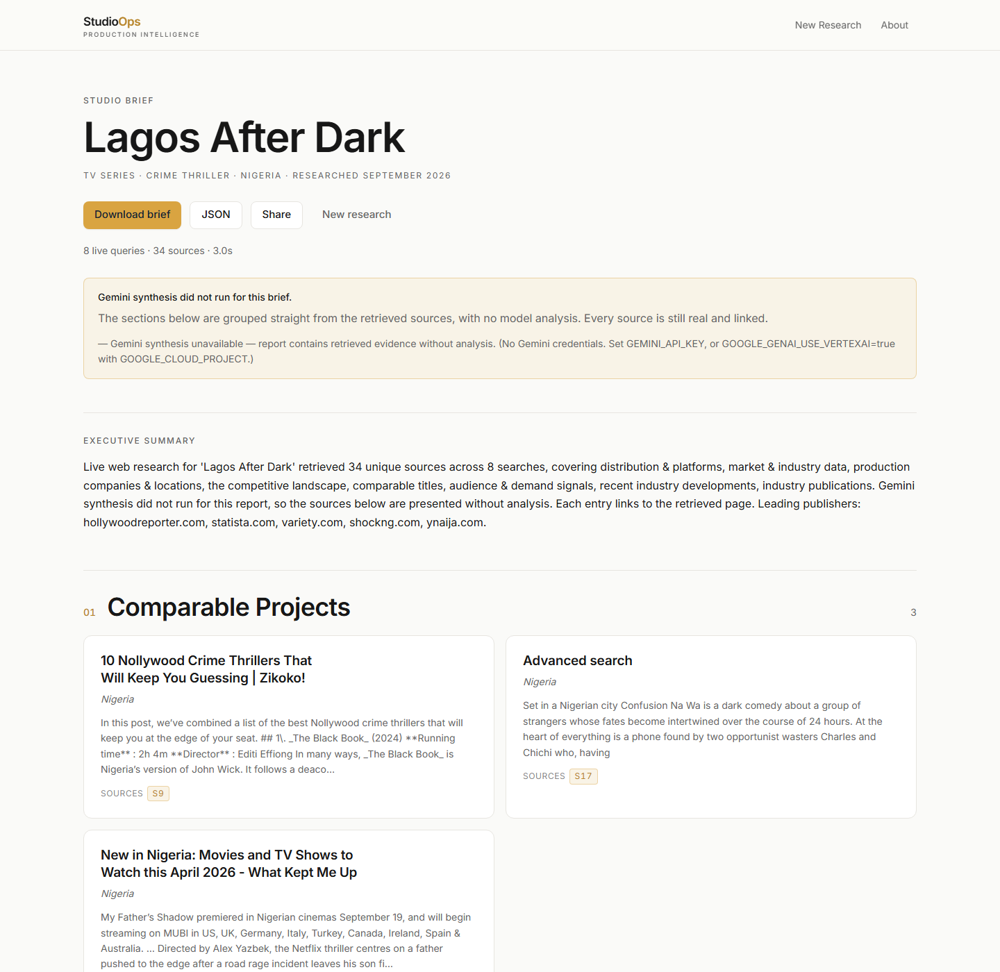

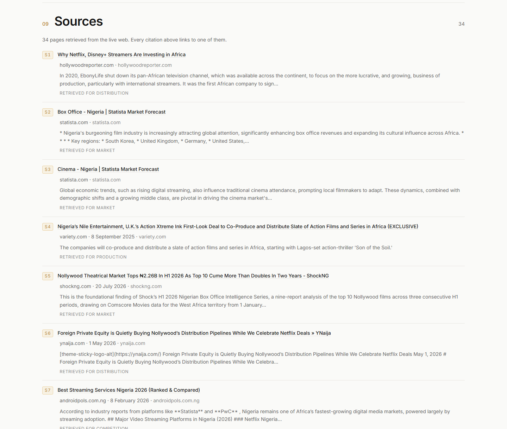
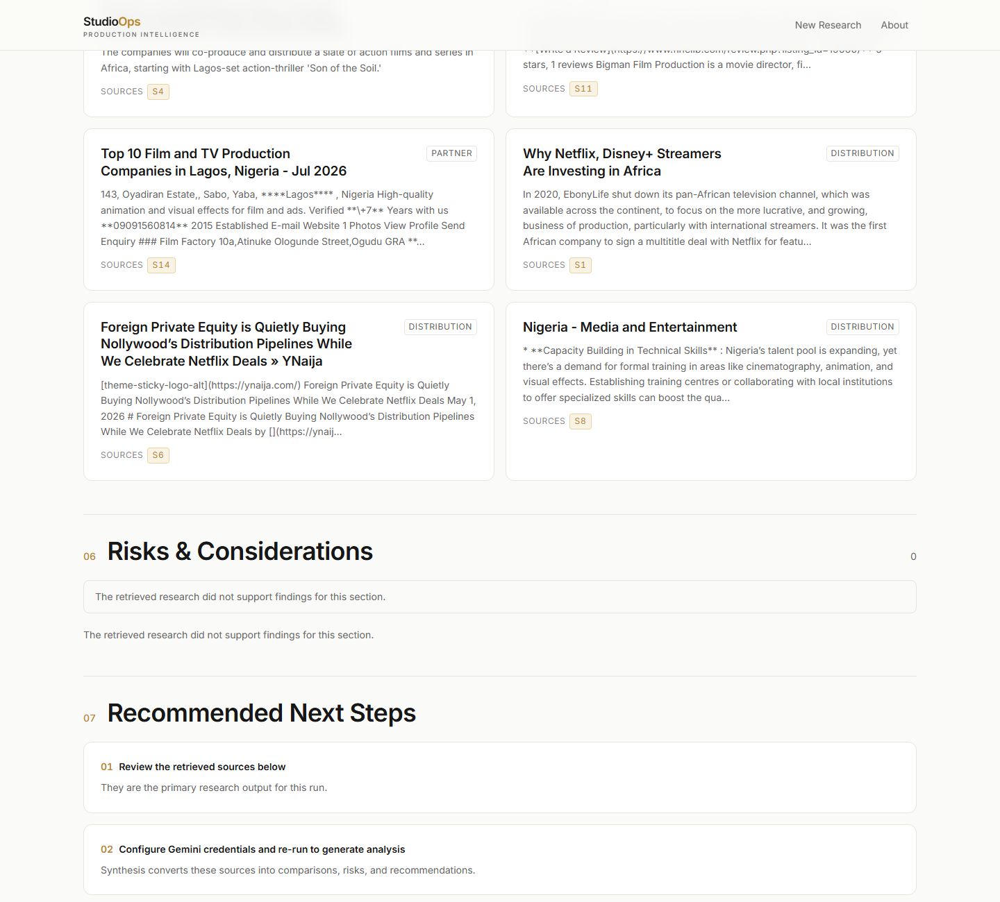
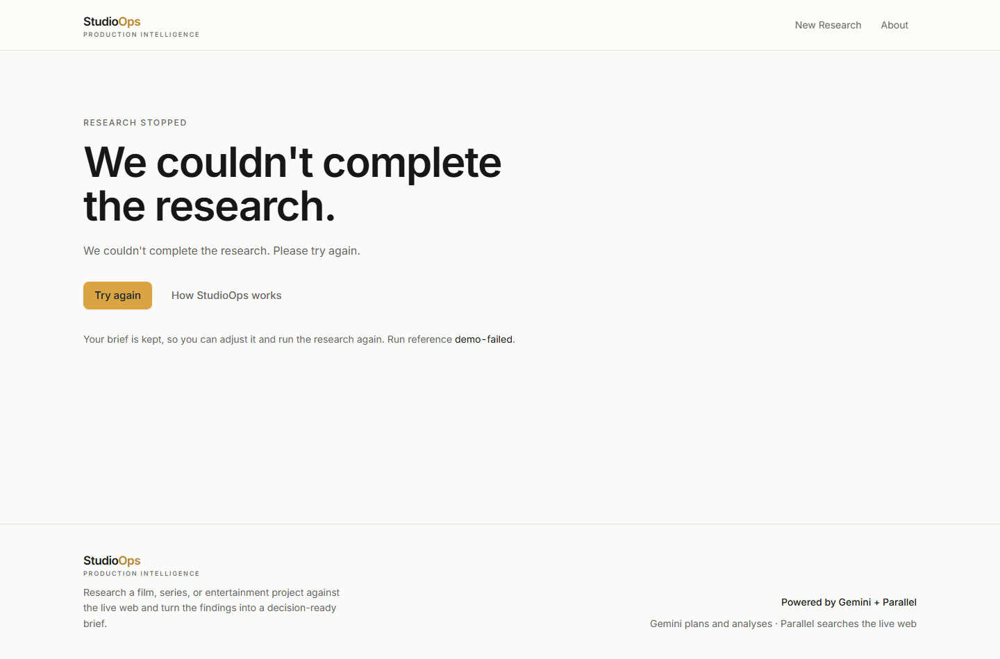

# StudioOps — Production Intelligence for Film & Television

*Turn an idea into a decision-ready, fully-sourced Studio Brief in under a minute.*

---

## The one-line version

StudioOps is a research analyst for the screen industry. You describe a film or
series in plain language; it plans the research, searches the live web, and
returns a structured **Studio Brief** — comparable titles, market signals,
audience insight, competition, opportunities, and risks — with **every claim
traced to a real source you can open and read.**

It is built on two engines working in concert: **Google Gemini** for reasoning
and analysis, and **Parallel** for live web search. The result is intelligence
that is both sharp *and* grounded in current, verifiable evidence.

---

## 1. The problem: high-stakes decisions on low-quality information

Every development and greenlight decision in film and television rides on
information that is scattered, fast-moving, and expensive to assemble:

- What did *comparable* titles actually do at market?
- Who is commissioning in this territory **right now**?
- Where are audiences heading, and how fast?
- What incentives, partners, and distribution routes apply?
- What could quietly sink the production?

Answering these today means hours across trade press, paywalled databases, and
half-remembered deals — or deciding on instinct and hoping. The obvious
shortcut, asking a general-purpose AI chatbot, is *worse than no answer*: it
invents box-office figures, fabricates comparable films, and cites sources that
do not exist. For a decision worth millions, that is not intelligence. It is a
liability.

**The market is real and growing.** Streamers are investing heavily in local
production across emerging territories, and the volume of projects competing for
the same commissioning attention keeps rising. Yet the research layer under
those decisions has barely changed. StudioOps is that missing layer.

---

## 2. The product

A single screen. Describe the project, press **Start Research**, and watch the
work happen.

Notice three deliberate choices, visible before you even type:

- **No accounts, no setup.** The value is delivered on the first interaction.
- **Honesty is surfaced up front.** The amber banner tells you exactly what this
  particular deployment can and cannot do right now — here, that Gemini analysis
  is not configured, so the brief will be grouped from sources without model
  commentary. StudioOps never pretends to a capability it does not have.
- **The method is stated plainly** — four steps, from an idea to an evidenced
  brief — so the user trusts the process before they trust the output.

---

## 3. How it works: an agentic pipeline you can watch

Most AI products hand you a spinner and then a wall of text. StudioOps does the
opposite: it shows its work, live, as an analyst would talk you through their
process.

Under the hood this is a four-stage **agentic pipeline**, and the screen above is
a faithful, real-time reflection of it — driven by a live event stream from the
server, not a scripted animation:

1. **Understand the brief.** Gemini reads what you are making, who it is for, and
   what you need to know, and turns that into a research plan. (When Gemini is
   unavailable, a film-aware deterministic planner produces the same structured
   plan — visible above as *"Deterministic plan for a Crime Thriller series in
   Nigeria."*)
2. **Search the live web.** The plan becomes a set of targeted queries —
   comparables, market, audience, competition, production, distribution,
   industry news — dispatched to the Parallel Search API. Each query reports its
   own status in real time: you can see four searches *in progress* and four
   *queued* in the panel above, each tagged with its category.
3. **Analyze the findings.** Retrieved pages are normalized, de-duplicated, and
   categorized, then Gemini reads across them to extract the signals, patterns,
   opportunities, and risks that matter for the decision.
4. **Build the Studio Brief.** Everything is assembled into a clean, structured,
   downloadable document.

The stepper at the top — *Understanding brief ✓ complete*, *Searching the web ●
in progress* — turns an opaque AI process into something a producer can follow
and trust.

---

## 4. The deliverable: a Studio Brief

When the pipeline finishes, the brief opens on its own.

This is the product's payload, and it is laid out for a fast, confident read:

- A **masthead** that states the project and its parameters at a glance —
  *TV Series · Crime Thriller · Nigeria · Researched September 2026* — with
  one-click **Download**, **JSON**, and **Share**.
- A run **receipt** — *8 live queries · 34 sources · 3.0s* — so the reader knows
  exactly how much evidence sits behind the document. (Those are the real
  figures from this run: eight searches, zero failed, thirty-four unique sources,
  synthesized in about three seconds.)
- An **executive summary**, then numbered sections: Comparable Projects, Market
  Landscape, Audience Intelligence, Competitive Landscape, Production
  Opportunities, Risks & Considerations, Recommended Next Steps, What We Could
  Not Confirm, and Sources.
- **Citations on every card.** Each finding carries the source chips (`S9`,
  `S17`, …) that back it, linking straight to the page it came from.

<b>See the full brief, end to end</b> (long image)

---

## 5. Grounded, not guessed: the anti-fabrication guarantee

This is the heart of why StudioOps exists. Every citation in the brief resolves
to a real, retrieved, dated web page — collected in a full bibliography at the
end of the document.

Each entry shows its citation id, a **clickable title**, the **publisher, date,
and host**, an excerpt of what was actually retrieved, and which research
category it served — *"Retrieved for Distribution," "Retrieved for Market."*
The sources here are exactly what you would expect a human analyst to pull:
*The Hollywood Reporter*, *Statista*, *Variety*, and regional trade outlets.

The engineering behind this is strict and deliberate:

- The synthesizer may cite **only** the source ids it was actually given
  (`S1…Sn`). Any invented citation is dropped.
- Any claim that cannot be tied to a real source is **discarded**, not published.
- Figures, comparables, companies, and quotes are never fabricated to fill a gap.

**If StudioOps cannot confirm something, it says so** — plainly, in a dedicated
*"What We Could Not Confirm"* section — rather than inventing a confident answer.
You can trust the brief because you can check it.

---

## 6. Honest by design

A tool that overstates itself is dangerous in exactly the moment it matters most.
StudioOps is engineered to degrade *honestly*, and to fail *gracefully*.

When a section has no supporting evidence, it says so — *"The retrieved research
did not support findings for this section"* — instead of padding it with
plausible-sounding filler. When the analysis engine is not configured, the brief
is transparent about it and tells you exactly what to do to unlock full
synthesis. The retrieved sources are still real, still linked, and still useful
on their own.

And when a run cannot complete at all, the failure is calm and recoverable — no
stack traces, no lost work:

*"We couldn't complete the research."* One clear message, a **Try again** button,
and a promise that is kept: *your brief is preserved,* so you can adjust it and
re-run without retyping a thing.

---

## 7. Under the hood

StudioOps is a production-grade application, not a demo script.

| Layer | Technology | Why it matters |
|---|---|---|
| **Reasoning & analysis** | Google **Gemini** via the `google-genai` SDK (Vertex AI *or* Developer API) | Plans the research and synthesizes findings into decision-ready analysis. |
| **Live web research** | **Parallel** Search API | Retrieves current, real web evidence — the ground truth every claim rests on. |
| **Backend** | **FastAPI** + Pydantic v2, async workflow orchestrator | Runs the four-stage pipeline and streams progress as it happens. |
| **Real-time UI** | **Server-Sent Events** with a polling fallback | The live screen reflects true server state, degrading safely if the stream drops. |
| **Frontend** | **Next.js 14** (App Router), TypeScript, Tailwind CSS | A fast, typed, accessible interface with no build-time surprises. |
| **Quality** | **297 automated tests** | Citation validation, fallback behavior, and the pipeline are all covered. |

Two design principles run through all of it:

- **Credentials are never a hostage.** The app runs end-to-end without Gemini or
  Google Cloud configured — it simply tells the truth about the reduced mode.
  Add credentials and full synthesis switches on. No key ever reaches the browser.
- **The stream is the source of truth.** What you see on the live screen is the
  same event stream the orchestrator emits — progress is observed, never faked.

---

## 8. Built to ship

StudioOps is containerized and deploys to **Google Cloud Run**. Both services
run as lean, non-root Docker images; all secrets — the Parallel key, the Gemini
service account — are supplied at deploy time through **Google Cloud Secret
Manager** and never touch the repository or the image. Startup logs state
exactly which integrations came up, so a misconfigured deploy is obvious rather
than silent. The full walkthrough lives in [docs/deployment.md](docs/deployment.md).

---

## 9. Why it matters

The screen industry does not lack ambition, projects, or capital. It lacks a
fast, trustworthy way to put evidence under a decision. StudioOps delivers that
in three moves that no chatbot can match:

- **Speed** — a day of analyst work in under a minute.
- **Structure** — the same rigorous brief, every time, ready to forward to a
  financier or partner.
- **Trust** — every claim sourced, every gap disclosed, nothing invented.

Describe an idea. Watch the research run. Read a brief you can actually stand
behind.

---

*StudioOps was built for Agentic Cinema: The Blockbuster Hackathon. It combines
Google's Gemini for reasoning and analysis with Parallel for live web research,
so the intelligence it produces is both sharp and grounded in real, current
sources.*
