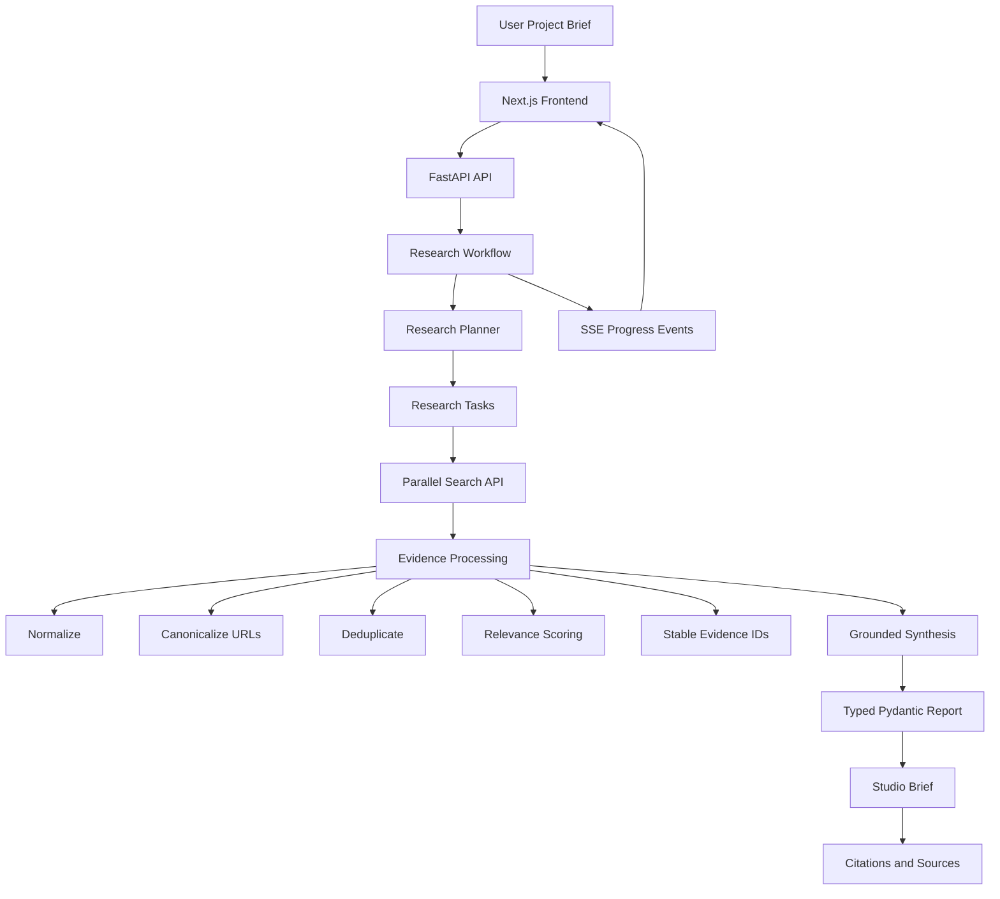

# StudioOps

### An evidence-grounded AI research workflow for entertainment projects

StudioOps turns an unstructured production brief into a structured research report by planning research tasks, searching the web, processing evidence, and synthesizing cited findings.

**Workflow:**
`Project Brief → Planning Agent → Targeted Research → Evidence Processing → Grounded Synthesis → Cited Studio Brief`

---

## Why StudioOps?

Entertainment research often requires pulling information from many sources before making decisions about a project.

StudioOps automates that workflow.

Instead of asking an LLM to answer a broad question directly, StudioOps:

* breaks the brief into research tasks
* generates targeted search queries
* retrieves live web evidence
* normalizes and deduplicates sources
* scores evidence for relevance
* assigns stable evidence IDs
* synthesizes findings from the retrieved evidence
* produces a structured report with source references

The main engineering principle is:

> **The LLM is one component of the system, not the system itself.**


---

## Architecture



---

## AI Architecture

### 1. Research Planning

A project brief is first converted into a structured research plan.

The planner identifies the research areas required for the project and creates individual research tasks.

When Gemini is available, the model generates targeted search queries.

When it is unavailable, StudioOps falls back to a deterministic planning strategy.

This keeps the workflow functional without pretending an LLM was used when it was not.

---

### 2. Targeted Web Research

Each research task is sent to the **Parallel Search API** with:

* a specific research objective
* targeted search queries
* controlled result limits
* controlled text extraction limits

The dedicated retrieval layer keeps web research separate from the reasoning and synthesis layers.


---

### 3. Evidence Processing

Retrieved pages are processed before reaching the synthesis stage.

The evidence pipeline:

1. Normalizes source data
2. Canonicalizes URLs
3. Removes tracking parameters
4. Deduplicates overlapping results
5. Filters unusable content
6. Scores source relevance
7. Assigns stable evidence IDs such as `S1`, `S2`, `S3`

This is important because multiple search queries can return the same source.

Instead of passing duplicated results directly to the model, StudioOps creates a cleaner evidence corpus.

The relevance score is a **retrieval heuristic**, not a claim of factual confidence.

---

### 4. Grounded Synthesis

The synthesis stage receives the structured research evidence and generates the final report.

Substantive report objects carry references to the evidence supporting them.

This creates a traceable relationship:

```text
Report Claim
    ↓
Evidence IDs
    ↓
Retrieved Sources
    ↓
Original URLs
```

The result is a research workflow where generated findings can be traced back to the evidence retrieved during the run.


---

## Structured AI Output

StudioOps does not rely on free-form model output for the final application state.

The report is represented through typed **Pydantic models**, including:

* Market Signals
* Comparable Titles
* Audience Insights
* Competitive Insights
* Opportunities
* Risks
* Recommended Next Steps
* Research Sources

This creates a defined contract between the AI layer, backend workflow, API, and frontend.

Additional validation helps prevent malformed model output from becoming application state.

---

## Citation Integrity

Every substantive claim type supports evidence references.

For example:

```text
Market Signal
    └── evidence_ids: ["S2", "S7"]

S2 → Source URL
S7 → Source URL
```

If available evidence doesn't support a finding, the system can surface the research gap instead of inventing supporting information.

---

## Real-Time Research Workflow

Research can run asynchronously.

### API

```text
POST /api/v1/research
POST /api/v1/research/async

GET /api/v1/research/{run_id}
GET /api/v1/research/{run_id}/events
```

The asynchronous workflow uses **Server-Sent Events (SSE)** to stream progress to the frontend.

The user can see stages such as:

```text
INTAKE
  ↓
PLAN
  ↓
SEARCH
  ↓
COLLECT
  ↓
SYNTHESIZE
  ↓
REPORT
```

This makes the agent workflow observable instead of hiding the entire process behind a loading spinner.

---

## Reliability & Failure Handling

External APIs fail. AI systems also produce imperfect output.

StudioOps is designed around those realities.

### Implemented safeguards

* Gemini timeout handling
* Structured JSON generation
* Retry logic for transient search failures
* Exponential backoff
* `Retry-After` support
* Search result normalization
* URL canonicalization
* Evidence deduplication
* Deterministic fallbacks when Gemini is unavailable
* Partial-result handling
* Explicit failed-task tracking
* Bounded in-memory run storage
* Safe user-facing error messages
* SSE listener isolation

A failed research task does not automatically destroy the entire workflow.

When individual searches fail, the system can continue with the available evidence and appropriately mark the resulting report.


---

## Engineering Decisions

### Provider abstraction

Gemini access is isolated behind a dedicated client.

The planning and synthesis layers do not need to know the underlying provider implementation.

This makes it possible to replace or add model providers without rebuilding the workflow architecture.

### Dedicated retrieval layer

Web research is handled independently through the Parallel API adapter.

This keeps:

```text
Planning
Retrieval
Evidence Processing
Synthesis
```

as separate responsibilities.

### Typed contracts

Pydantic models define the expected structure of research results and final reports.

### Honest fallbacks

If an LLM is unavailable, StudioOps uses deterministic logic where possible and explicitly identifies fallback-generated output.

---

## Testing

The project includes automated tests covering the complete research workflow.

Tests cover:

* workflow stage ordering
* research planning
* search execution
* evidence collection
* evidence deduplication
* citation resolution
* progress events
* SSE behaviour
* run tracking
* Gemini fallback behaviour
* configured Gemini synthesis
* partial search failures
* complete search failures
* empty research results
* malformed workflow states
* API validation
* error handling

CI runs the test suite through **GitHub Actions** on pushes and pull requests.

---

## Tech Stack

| Layer        | Technology                               |
| ------------ | ---------------------------------------- |
| Frontend     | Next.js, React, TypeScript, Tailwind CSS |
| Backend      | Python, FastAPI                          |
| AI           | Gemini                                   |
| Web Research | Parallel Search API                      |
| Validation   | Pydantic                                 |
| Async Events | Server-Sent Events                       |
| Testing      | Pytest                                   |
| CI           | GitHub Actions                           |
| Deployment   | Vercel + backend hosting                 |

---

## Screenshots

### Research Report


### Sources & Evidence


The report keeps the research findings connected to the underlying sources, allowing users to inspect where the information came from.

---

## Project Structure

```text
StudioOps/
├── backend/
│   ├── agent/
│   ├── api/
│   ├── integrations/
│   ├── models/
│   ├── services/
│   ├── tools/
│   └── tests/
│
├── frontend/
│   ├── app/
│   ├── components/
│   └── ...
│
├── docs/
│   ├── Documentary.md
│   └── images/
│
├── .github/
│   └── workflows/
│
└── README.md
```

---

## Local Development

### Backend

```bash
cd backend

python -m venv .venv
source .venv/bin/activate

pip install -r requirements.txt

uvicorn main:app --reload
```

### Frontend

```bash
cd frontend

npm install
npm run dev
```

Configure the required environment variables for the Parallel Search API and Gemini integration before running the complete workflow.

---

## Current Limitations

StudioOps is a V1 system and intentionally keeps some infrastructure simple.

Current limitations include:

* run state is stored in memory
* reports are stored on disk
* long-running jobs use application-level background tasks
* the system is not designed for horizontal scaling yet
* retrieval quality remains dependent on the external search provider
* relevance scoring is heuristic rather than semantic
* production deployment requires external API credentials

These are known engineering trade-offs rather than hidden limitations.

---

## Future Engineering Work

Potential next steps include:

* persistent run storage
* distributed job workers
* scalable object storage for reports
* stronger semantic evidence ranking
* source-quality and cross-source corroboration scoring
* evaluation datasets for research quality
* additional model providers
* authentication and user workspaces
* richer research-history management

---

## Project Context

StudioOps was originally developed as an **agentic AI research project for an entertainment-industry hackathon track**.

The hackathon provided the initial constraint and use case.

The underlying architecture was designed to demonstrate broader AI engineering principles:

* agentic workflows
* tool-using systems
* evidence-grounded generation
* structured AI output
* asynchronous processing
* external API integration
* graceful failure handling
* automated testing

---

## Author

**Kenneth Okenwa**

AI / Automation Engineer focused on building practical software systems around AI, automation, research, and financial workflows.

GitHub: [@Anekenonso](https://github.com/Anekenonso)

---

## License

See the repository license for details.
